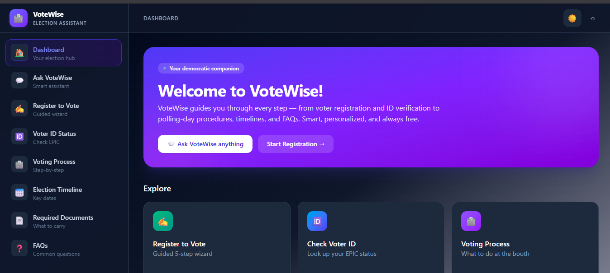

# 🗳️ VoteWise – Election Guidance Assistant

VoteWise is a smart election assistant that helps users navigate the entire voting process — from registration to polling day — with ease and clarity.

---

## 🚀 Live Demo
👉 https://election-guidance-assistant-cqly.vercel.app/

---

## 📸 Preview



> 💡 Make sure you save your screenshot in your repo (e.g., `assets/dashboard.png`)

---

## ✨ Features

- 🧠 Smart Assistant (Ask VoteWise anything)
- 📝 Voter Registration Guide (Step-by-step)
- 🆔 Voter ID (EPIC) Status Checker
- 🗳️ Voting Process Guide
- 📅 Election Timeline & Key Dates
- 📄 Required Documents Info
- ❓ FAQs Section

---

## 🛠️ Tech Stack

- Frontend: React / Next.js (based on your project)
- Styling: Tailwind CSS
- Deployment: Vercel

---

## 📂 Project Setup

```bash
# Clone the repo
git clone https://github.com/rohitbiswas1/election-guidance-assistant.git

# Go to project folder
cd election-guidance-assistant

# Install dependencies
npm install

# Run locally
npm run dev
